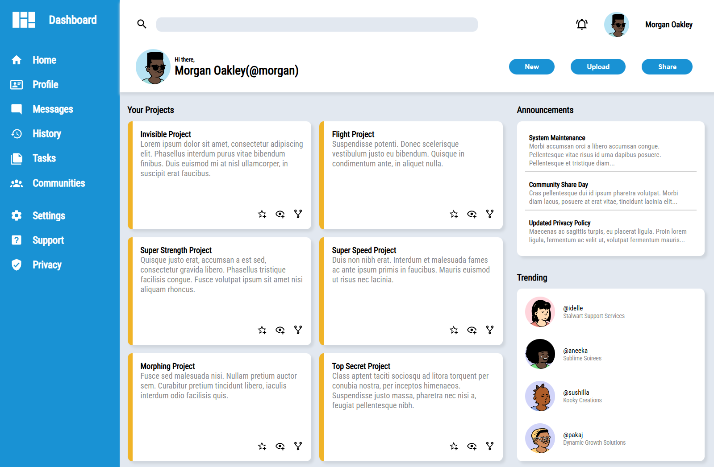

# Admin Dashboard
An admin dashboard built from scratch using modern HTML and CSS. 

This project is part of [The Odin Project's Full Stack Javascript path](https://www.theodinproject.com/paths/full-stack-javascript) and focuses on layout techniques, in particular CSS Grid, to reproduce a professional dashboard interface. 

## Screenshot


## Installation
1. Clone the repository
2. Navigate to the project folder: ```cd admin-dashboard```
3. Open index.html in any modern browser

## Assets and Attribution
Font: Roboto

Icons and Images:
* Icons: [Material Design Icons](https://pictogrammers.com/library/mdi/)
* Avatars: [DiceBear Playground > Open Peeps](https://www.dicebear.com/playground/)

## Live Demo
A live demo is available here: [Admin Dashboard](https://keegan-george.github.io/admin-dashboard/)